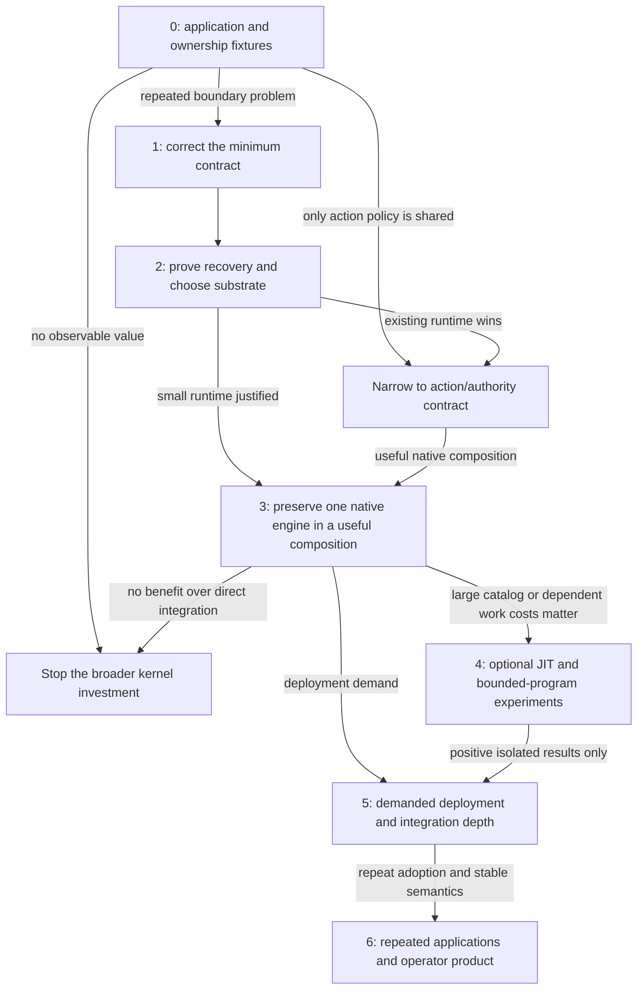

# A dependency-ordered roadmap with exit branches

[Study home](README.md). This is a proposed replacement for the investment sequence, not an automatic edit to the active roadmap. It asks **what must be stable before the next layer is safe to build**. Stability means a tested contract and a justified ownership decision; it does not mean a frozen implementation or a 1.0 label.

## The change in direction

The current [H–N roadmap](../development/001-current-status-and-roadmap.md) advances broad service/schema contracts, protocol coverage, discovery, isolation, durable recovery, and an integrated architecture campaign. It protects useful distinctions, but it also risks accumulating surfaces before resolving the runtime's hardest boundary and before establishing why users need it.

Replace that sequence with **decision evidence → core correction and recovery → one useful heterogeneous application → optional environment extensions → demanded deployment depth → product surfaces**. Bring a minimal authoritative schema/data boundary forward. Move broad descriptor taxonomies, exhaustive MCP/A2A work, native Agent feature expansion, and Studio later or remove them. Split hosted work: specify the actual trust profile early, but build broad hostile-code hosting only when the selected application requires it.

The [Machine note](../research/arrokothi-machine-abi-and-program-model.md) places its major prototype sequence after 1.0. Run small disposable discovery/program experiments earlier, after the relevant action/data contract is testable. Do not let them become a parallel permanent platform or delay the recovery proof. A negative experiment now can prevent a much larger migration later.

## Decision graph

The “narrow” branch need not abandon the ArrokothI name or every execution API. It means reuse the authoritative durable substrate and retain only the semantic layer the evidence justifies. Do not continue a custom runtime merely because existing tests make it easy to add another feature.

## Stage 0 — Establish the decision, not a feature inventory

**Uncertainty:** is there a repeated application problem that needs this common boundary, and what is the smallest solution?

**Enter with:** the present checkout and this evidence review. No new abstractions are prerequisites.

**Work:** select the two application shapes in E0, write public acceptance criteria and negative cases, and implement the smallest direct/native baseline. Document every authoritative owner: business state, native checkpoint, enclosing lifecycle, action admission, human approval, physical environment, and delivery. Choose one mature durable baseline for deeper comparison. Record hypotheses, measurements, and an explicit decision date.

Use a compact decision record to classify existing concepts as required, optional authoring, implementation-only, or speculative. Review product promises against currently demonstrated integration assurance. Confirm the application's trust profile before claiming mediation of native tools. Reconcile stale benchmark/evidence pointers by exact build identity when accepting a new baseline.

**Exit evidence:** a specific repeated obligation that ArrokothI removes or makes testably safer, an observable outcome for each claim, and baseline implementations sufficiently competent to falsify the claim. A user need inferred from code is still a hypothesis; seek actual adoption evidence before product commitments.

**Safe afterward:** scoped contract changes with known consumers and tests. **Deliberately unbuilt:** generic adapter registry, new schema taxonomy, Studio, hosted fleet, automatic graph translation, universal machine.

**Branch:** if only concrete action governance is shared, choose the smaller library/conformance-kit direction. If the direct baseline is adequate and cheaper in both application shapes, stop general kernel expansion and retain the useful tests/research. Do not interpret a missing customer interview as evidence of demand.

**Small-team allocation:** approximately 3–5 focused engineering days for fixtures and a decision draft, plus whatever real user feedback is needed. This is a planning estimate, not evidence or a fixed delivery promise.

## Stage 1 — Correct the minimum semantic boundary

**Uncertainty:** can the core express useful typed composition and foreign execution without carrying a stock Agent's internal model, while keeping authority and progress coherent?

**Enter with:** Stage 0 applications, ownership tables, and a chosen small scope. The existing invariants in the canonical owners are understood before any accepted change.

**Work, ordered:**

1. Define authoritative operation/payload validation at actual dispatch using a mature schema implementation. Specify operation identity/version, unsupported schema behavior, unknown operations, output validation, and exact consent binding. Do not expand every descriptor category.
2. Resolve typed local results, computed terminal returns, and artifact references with the E3 examples. Decide whether the change belongs in the SDK/controller or the kernel. Do not force application values through structured memory to compensate for text-only edges.
3. Write the activation/attempt acceptance protocol required by R1–R3: input identity, writer epoch, accepted progress, dispatch intent, durable wake, and stale completion. This specifies what the next stage must prove; it is not yet a claim that recovery works.
4. Test whether an opaque, versioned native-runner progress envelope is needed. Keep the current Agent executor as a supported narrow strategy. If the closed Agent/Workflow discriminator blocks an honest runner, revise it with explicit stored-version migration and compatibility handling.
5. Separate semantic categories from shared mechanics: retain Effect/Event/local-resumption meanings while designing one reusable private attempt/recovery facility where appropriate. Establish which invocation snapshots are durable truth and which views are disposable caches.

**Exit evidence:** E3 passes through public APIs; invalid payloads are rejected through every relevant entry path; the two applications have a single owner for each responsibility; the recovery protocol has explicit outcomes for each fault boundary. Canonical docs, code, and conformance tests move together for accepted changes. Old serialized progress either migrates explicitly or fails with a clear unsupported-version result.

**Safe afterward:** persistent recovery implementation, a small native task bridge, and disposable discovery projections over the tested action boundary. **Deliberately unbuilt:** production distributed storage, broad foreign-engine import, new planning/memory engines, all-protocol parity, a general Program VM.

**Branch:** if typed composition and foreign jobs can remain entirely above an unchanged small core, keep them above it. If the underlying durable baseline exposes an already adequate execution contract, narrow ArrokothI before creating a second one. If no coherent ownership map can be written, revisit Stage 0 rather than adding another adapter type.

**Allocation:** one or two short slices, roughly 1–2 focused weeks depending on accepted semantic changes. Models can draft implementation and tests; a single accountable reviewer should check the linearization and migration argument, not only passing test output.

## Stage 2 — Prove restart recovery and select the durable substrate

**Uncertainty:** is a small ArrokothI runtime worth owning, or should an existing durable system supply the execution machinery?

**Enter with:** a stable-enough activation/action contract and deterministic fault fixtures. No paid model or canonical benchmark container is required to begin.

**Work:** implement the minimum persistent execution path in a transactional local backend or a thin existing-runtime facade. Build only enough of the alternative to make the choice credible. Use actual worker process death and independently recorded external action state. Cover input reservation/acceptance, controller invocation, intent persistence, external success without receipt, settlement without wake, and stale worker takeover. Add persisted timers/deadlines only as needed by the fixtures.

Decide writer fencing, outbox/ready repair, attempt identity, idempotency and unknown reconciliation, checkpoint version/code availability, and cost accounting for repeated controller-local work. Specify the atomic boundary of parent/child creation, communication, and root spawn budget; do not assume per-execution partitioning makes those operations local. Prefer one-node durability before distributed scale. Check retention and physical transaction cost so the in-memory whole-copy pattern does not accidentally become the production shape.

**Exit evidence:** E1 passes for the declared failure model, with raw traces and restart scripts. No accepted input disappears; no stale writer is accepted; uncertainty remains explicit; wakeups recover. The backend choice is supported by correctness, implementation burden, operational requirements, and measured overhead. A promise to add reconciliation later is not an exit gate.

**Safe afterward:** long human waits, restartable application jobs, native tasks whose outer lifecycle must survive a process, and operator inspection of real recovery. **Deliberately unbuilt:** multi-region consensus, a proprietary database, a broad cloud platform, general untrusted plugin hosting, public durability claims beyond the tested failure model.

**Branch:** if the mature durable substrate is simpler and meets the contract, adopt it and stop custom scheduling/storage development. If the application needs only a queue and database, use that and keep ArrokothI small. If the minimum runtime cannot recover truthfully, freeze upper-layer work until the contract is corrected or the direction is abandoned.

**Allocation:** about 2–3 focused weeks for one credible proof and comparison, then an explicit continue/narrow decision. More infrastructure is justified only by a demonstrated requirement, not by completing a “durability” checklist.

## Stage 3 — One heterogeneous application that retains native strengths

**Uncertainty:** does a shared boundary add value without taking over the native engine's cognition and lifecycle?

**Enter with:** truthful restart/recovery behavior for the enclosing task, typed results, and a declared trust profile. Use external-task integration first. Containment must be present before claiming mediation of untrusted native code; an unenforced interface is labeled trusted/cooperative.

**Work:** choose one specialist based on the application, not project popularity. Hermes is a useful stress case for native context/environment ownership; a Crew is useful for native team/Flow behavior; OpenClaw tests gateway/native harness ownership; Dify tests published application and human-form boundaries. Integrate exactly one initially.

Combine its native job with a deterministic validator and one shared governed action/human interaction. Preserve its native context and model routing. Store only the native identifiers and checkpoint reference needed for the enclosing contract. Implement cancellation, result acceptance, late completion, principal restoration, and artifact access. Record an adapter assurance vector and test every claim. Add a second engine only to test whether the same boundary survives independent design.

Run E2 against native-only and direct composition. Perform one supported upstream-version upgrade exercise before treating the adapter as cheap to maintain. A maintained compatibility test is more valuable than a long list of nominally supported frameworks.

**Exit evidence:** an application outcome or integration burden improves; native success/fidelity remains within the chosen margin; no claimed action path bypasses mediation; ownership and recovery work after restart. Two independent consumers are required before promoting a portable adapter API as stable.

**Safe afterward:** selected deeper integration, a common action/environment facade demanded by both consumers, or an application SDK built around actual recurring patterns. **Deliberately unbuilt:** automatic cross-framework graph translation, exhaustive adapter support, shared universal transcript, generic multi-Agent marketplace, replacement native cognition.

**Branch:** if black-box jobs suffice, keep them and delete deeper adapter work. If mediation destroys the engine's value, narrow the guarantee to the external task boundary or reject that integration. If no improvement over direct native composition appears, stop the heterogeneous-kernel thesis rather than hiding the result with more demos.

**Allocation:** 1–2 focused weeks for one engine/application proof; the second is a portability experiment with its own budget, not an immediate support obligation.

## Stage 4 — Optional environment experiments, promoted separately

**Uncertainty:** do progressive context discovery or suspendable programs improve useful work enough to justify a shared environment abstraction?

**Enter with:** a valid action/data contract. A disposable read-only discovery experiment can begin after Stage 1; a durable suspendable-program experiment requires Stage 2. Promotion to shared production API requires Stage 3 consumers. This separation allows early learning without premature dependency.

**Work:**

- Run E4 for JIT discovery. Begin with deterministic retrieval and native search/describe/call. Add hierarchy only to test a measured scaling problem. Add a scout only after accounting for the simpler approaches.
- Run E5 for bounded programs only if repeated model-mediated data transformations materially cost time or tokens. Reuse the existing attempt mechanism. Limit the prototype language to the needed values, branches, and governed calls.
- Investigate shared Agent/Workflow computation only if the prototype removes duplicated implementation. Two control modes sharing mechanisms does not require every foreign engine to compile to the IR.

**Exit evidence:** each feature independently passes its quality, authority, cost, and simplicity gate. Two independently implemented consumers can use a minimal versioned environment boundary. A namespace-only result does not authorize a VM; a VM result does not authorize universal workflow import or an operating-system metaphor in public APIs.

**Safe afterward:** the specific successful discovery strategy or bounded-program execution mode, behind replaceable engine/environment interfaces. **Deliberately unbuilt:** POSIX emulation, unbounded general language, arbitrary filesystem mounts, mandatory Machine terminology, universal memory namespace, all-engine IR.

**Branch:** if flat retrieval wins, reuse it and remove hierarchy. If scouts omit evidence or erase savings, remove them. If ordinary functions/native code tools capture program benefits, use them and abandon the new language. Negative outcomes should simplify the roadmap.

**Allocation:** each experiment is capped initially at roughly 3–5 focused days plus calibrated evaluation cost. Do not run every arm at full scale before pilots show which distinctions matter.

## Stage 5 — Demand-driven deployment depth and collaboration

**Uncertainty:** which operational guarantees and integration depths actual users require, and whether the team can support them economically.

**Enter with:** at least one useful application, an exercised adapter boundary, and a selected durable owner. Define the desired deployment profile explicitly: trusted embedded, hosted declarative, or isolated untrusted execution. A local success does not imply a hosted guarantee.

**Work:** add the minimum resource binding/lifetime contract, tenant/principal restoration, credential handling, leases, admission/fairness, and limits for the selected deployment. Reuse physical sandbox and browser implementations. Test E7, including loss versus suspension, cleanup, retention, and migration. Add protocol features only for real integration needs; protocol inventories are reference material, not an implementation backlog.

Deepen upstream tool mediation only when the application benefits and the host can enforce all claimed paths. Keep the number of supported deep adapters small. Expand multi-Agent primitives only after E6 demonstrates value beyond a single engine, equal-budget execution, or simple fan-out. A basic child/peer contract can remain supported without adding planners, supervisors, teams, or autonomous role marketplaces.

**Exit evidence:** declared failure and isolation guarantees hold in the actual deployment; costs and quotas meet the application's operating budget; at least one upgrade and recovery exercise succeeds; the small team can maintain the supported surface. Publish explicit unsupported capabilities.

**Safe afterward:** a supported deployment offering and recurring application patterns. **Deliberately unbuilt:** feature parity with OpenClaw channels, Hermes tools, Dify Studio, or CrewAI orchestration; custom sandbox infrastructure; federated trust or multi-region execution absent demand.

**Branch:** choose a managed substrate or external service when it meets the need more cheaply. Remove a deep adapter if its upgrade burden dominates its user value. If only a large infrastructure organization can operate the proposed product, narrow the target market or product rather than assuming models eliminate operational ownership.

**Allocation:** separately budgeted slices tied to one deployment requirement. This stage has no meaningful fixed duration until the target deployment is known.

## Stage 6 — Repeated applications before Studio

**Uncertainty:** is there a reusable product here, and which surface users repeatedly need?

**Enter with:** stable-enough identity/action/authority/recovery contracts, more than one independently built useful application, and operators who need shared inspection. A successful internal demo is insufficient.

**Work:** first expose a small read-oriented execution and authority inspector: accepted inputs, current wait, action proposal/approval/dispatch/outcome, native checkpoint references, artifacts, and recovery decisions. Use existing telemetry/UI tooling. UI commands that mutate authority or resume work must go through the same authenticated contract as every other client.

Observe repeated friction before investing in visual authoring. Build an application SDK around demonstrated patterns and sensible defaults; keep direct APIs available. Studio should project stable authoring and execution models rather than define new semantics. Hosted service work needs evidence of operational demand and a supportable business model, not only an attractive architecture.

**Exit evidence:** independent builders succeed within reasonable effort, operators solve real incidents with the shared evidence, and users prefer the system over direct alternatives. Track ongoing cost and support burden alongside adoption.

**Safe afterward:** a focused product roadmap driven by actual recurring use. **Deliberately unbuilt:** broad no-code platform, component marketplace, universal import, channel product, or replacement assistant unless customer evidence separately justifies one.

**Branch:** if the inspector/conformance kit is the valued product, keep it small. If users only need the action gateway embedded in another runtime, sell/support that boundary. Do not force Studio as the conclusion of a kernel research program.

## What should be stable before each investment

| Proposed investment | Must first be stable enough | Evidence gate |
|---|---|---|
| Deeper framework adapters | Single owner per responsibility; typed result and action contract; truthful native assurance. | E2, plus recovery appropriate to the claim. |
| Persistent backend | Activation acceptance, attempts, wake publication, fencing, version identity. | E1. |
| More Workflow features | Ordinary typed composition and computed results; clear controller/core split. | E3. |
| JIT namespace | Authorization-filtered discovery and descriptor freshness; measured catalog problem. | E4. |
| Logical Program/ABI | Dataflow, per-call authorization, durable continuation/attempt semantics. | E5; two independent consumers for ABI promotion. |
| Expanded multi-Agent support | Ownership/cancellation, results/artifacts, budget accounting, shared-resource policy. | E6. |
| Hosted untrusted engines | Actual isolation, scoped credentials/egress, resource limits, restored identity. | E7 in that profile; interface-only tests do not suffice. |
| Broad MCP/A2A support | A real integration requiring the feature and an honest semantic mapping. | Adapter-specific positive/negative conformance. |
| UI/Studio/Cloud | Repeated applications, stable inspection contract, actual operator demand. | Adoption and incident-resolution evidence. |

## How a very small team should execute this

Keep one primary implementation line and at most one disposable comparison spike at a time. Use capable models for code reconnaissance, fixture generation, adapter prototypes, migrations, and test execution, but keep one clear owner of semantic decisions and evidence interpretation. More generated code is not a substitute for deciding who owns recovery and authority.

At each stage, write a short decision: claim, evidence, strongest counterexample, accepted contract change, migration implications, remaining uncertainty, and work explicitly deleted. Preserve raw evidence and exact identities. Reuse the benchmark's sealed construction machinery only when the claim needs it; keep cheap deterministic diagnosis easy to run.

Do not declare a goal such as “architecture complete.” The appropriate early milestone is: **two applications demonstrate that this small boundary is useful, its declared failure semantics survive real faults, and its maintenance cost is lower than the complexity it removes.** If that milestone fails, the roadmap should become smaller.
