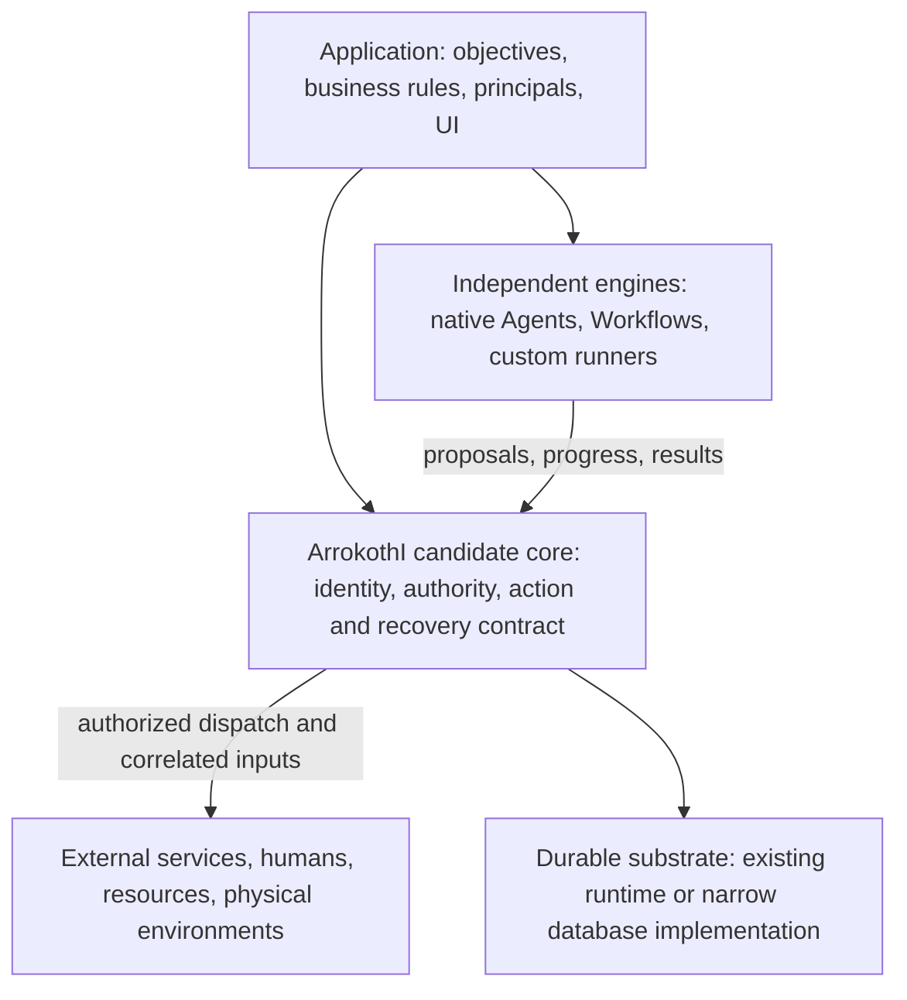

# ArrokothI: core, ecosystem, and investment decision

**Study date: 2026-09-07. Status: non-canonical research and proposed roadmap.** This study does not accept architectural changes, replace the active development plan, or establish new guarantees. Accepted changes must subsequently update their canonical owners, implementation, and conformance tests together.

## Current routing and source availability

The [adopted development plan](../development/001-current-status-and-roadmap.md) owns current
sequence and release gates; this study remains research. Its pinned upstream source links require
the sibling checkouts named in [the original manifest](evidence/source-manifest.json). Those four
upstream checkouts are absent from the current two-repository workspace, so their local source links
cannot be validated here. The manifest and recorded study results are preserved unchanged; the
study verifier checks the original capture environment and is not a current roadmap validation.

## Recommendation

**Continue ArrokothI as a bounded experiment in governed execution across independent engines. Do not yet commit to a general Agent platform, a universal Agent machine, or a new distributed runtime.** The current kernel has a defensible semantic foundation and an unusually explicit conformance discipline for its age. It has not demonstrated a differentiated product advantage. Several of its proposed differentiators already have substantial analogues in the surrounding systems.

The smallest coherent candidate core is **an execution and action boundary**: durable identity and progress; addressed inputs and waits; delegated authority; concrete action admission and exact consent binding; attributable attempts and outcomes, including uncertainty; and correlated communication and results. The implementation of persistence, scheduling, cognition, retrieval, and physical environments can be replaced. The meaning of authorization, accepted progress, correlation, and recovery cannot be delegated independently to whichever adapter happens to run.

There are two viable outcomes of the next experiments:

1. A small ArrokothI execution runtime, with a replaceable durable backend, materially reduces application coordination and recovery work across independent engines.
2. The useful part is chiefly the action/authority contract and its conformance kit, implemented over an existing durable runtime. In that case, shrink ArrokothI to that integration layer and stop developing a competing lifecycle engine.

A third outcome—direct native integration is equally safe and cheaper—is a legitimate reason to stop the broader kernel investment. These are alternatives to test, not three products to build simultaneously.

## Most consequential findings

| Finding | Evidence status | Consequence |
|---|---|---|
| Definition/Execution, proposal/outcome, exposure/authority, and memory/context are useful distinctions. | Canonical contracts plus extensive local tests. | Preserve meanings; do not require a separate package or public noun for each distinction. |
| Current persistence is a transactional in-memory reference; serializable state does not establish restart recovery. | Source observation. Crash consequences are reasoned risks, not an executed crash campaign. | Correct the activation/attempt/lease contract before extensive layering. A database adapter alone is insufficient. |
| The `AgentExecutor` port accommodates a constrained decision engine, not every native Agent environment. | Request already contains resolved model, compiled information, callable projection, and shaped observations; Strands interception is concrete narrow evidence. | Keep this useful port, but stop treating it as the universal heterogeneous boundary. Test an opaque native runner with explicit mediation limits. |
| Workflow text-only edges, literal terminal outputs, and inaccessible committed state at the Function Stage boundary obstruct ordinary typed composition. | Implementation, builder guide, and existing findings agree about the limits. | Resolve dataflow early; do not route every intermediate object through “memory” or an LLM. |
| OpenClaw already has native runtime harnesses, authority-sensitive tool bridges, and delivery reconciliation. Dify now has explicit persistent environment bindings and leases. | Current upstream source and selected tests. | “Heterogeneity” and “Agent environment” alone are insufficient differentiation. |
| Hermes and CrewAI preserve valuable native context, tool, delegation, and checkpoint behavior. | Current source, not README descriptions. | Deep wrapping that discards these strengths can have negative value. Start at an external task boundary. |
| The Machine/ABI research combines several separable hypotheses. | Research, not an implemented capability. | Test authorized discovery and bounded programs independently. Do not wait for an exhaustive 1.0, and do not commit to a universal IR. |
| The benchmark has strong evidence separation and construction controls, but no comparative advantage is established by the inspected canary. | Local artifacts and harness code. | Add fault/recovery and integration-fidelity tracks; distinguish subject behavior from protection supplied by the benchmark harness. |

## Proposed ownership

This is one logical authority and lifecycle owner **per responsibility**, not a requirement for one process or one global database. A native engine can own its internal checkpoint while ArrokothI owns the enclosing task. It cannot independently authorize the same external action and still claim that action was fully mediated by ArrokothI.

Own a minimum typed payload and artifact-reference envelope, not the application's whole database. Own approval binding and freshness at dispatch, not every approval UI. Own the declared lifetime and loss semantics of an environment binding if it crosses executions, not a shell implementation. Treat Agent and Workflow as authoring/control strategies above the shared execution boundary unless experiments reveal an invariant that truly depends on the distinction.

Keep the reference Agent and small Workflow controller as conformance vehicles and usable defaults. Move their prompt, context, planning, graph, and memory strategy choices out of the irreducible kernel. Do not delete working code just to achieve a smaller diagram; introduce package boundaries when they remove an actual dependency or permit a demonstrated replacement.

## Recommended sequence

1. **Decision fixtures and contract inventory.** Choose two representative applications and explicit direct/native and durable-runtime baselines. Write down lifecycle, action, authority, and checkpoint ownership. Establish a stop decision and maintain an evidence ledger.
2. **Core correction and recovery proof.** Resolve typed dataflow and opaque runner progress; prove mailbox/activation recovery, durable dispatch intent, unknown outcomes, and scheduler fencing with real process death. Compare a narrow database implementation against one existing durable substrate before choosing the production backend.
3. **One heterogeneous composition.** Preserve the native behavior of one mature engine and combine it with a deterministic process and a human action boundary. Prove fidelity, cancellation/ownership, and recovery. Add a second independent engine only to test portability.
4. **Optional environment experiments.** Trial JIT discovery, read-only context acquisition, then bounded suspendable programs only where measurements justify them. Promote a minimal ABI only after two independently implemented consumers need it.
5. **Selected deployment depth.** Add isolation, quotas, resource leases, and deeper adapters for a demonstrated deployment requirement. Expand multi-Agent patterns only when they beat a simpler baseline at equal budget.
6. **Application and operator surfaces.** Invest in a small execution/authority inspector when evidence capture warrants it; build Studio or a hosted product only after repeated application adoption and a stable boundary.

The detailed roadmap has entry conditions, explicit unbuilt scope, measurable gates, and deletion branches. This replaces the recommendation to finish broad protocol coverage, discovery, and containment before addressing durable recovery. It does **not** automatically modify the current H–N roadmap.

## Reading map

- [System architectures and competitive position](01-system-architectures.md): what each system owns, why they coexist, and where comparisons are misleading.
- [Core boundary and source review](02-core-boundary-and-review.md): preservation, simplification, proposed changes, and an actionable finding register.
- [Heterogeneous environments, Machine/ABI, and reuse](03-environment-and-reuse.md): ownership arrangements, attractive combinations, dangerous adapters, and subsystem choices.
- [Evidence, benchmark critique, and experiments](04-evidence-and-experiments.md): what was verified, what remains hypothetical, and falsification designs.
- [Dependency-ordered roadmap](05-core-first-roadmap.md): the implementation sequence and decision branches.
- [Pinned source manifest](evidence/source-manifest.json): exact repositories and host. [Evidence README](evidence/README.md): commands, limitations, and diagnostic artifacts.

## Method and limits

The review followed canonical concept ownership from [the architecture map](../README.md), inspected implementation and conformance tests, then compared current upstream mechanisms and their tests. It included the development baseline and roadmap, product vision, future plan, builder front door and examples, external engineering guidance, and the JIT, caching, interoperability, and Machine research. Sources are linked near the claims. Links into sibling repositories resolve in this local workspace; the manifest pins the revisions those links describe. They are not links to a continually current upstream contract.

**Observation** means a statement directly supported by the inspected source or artifact. **Inference** is a reasoned consequence with its assumptions stated. **Hypothesis** is a prospective benefit requiring an experiment. **Proven advantage** requires a suitable comparative result; none is claimed here. A test found in source establishes coverage intent; only the locally executed suites are reported as passing.

This is a deep, architecture-focused inspection of selected paths, not a line-by-line audit of all six repositories, a penetration test, a license opinion, or a production load test. Upstream internals imported from packages absent from these checkouts—especially Dify's `graphon` engine—were not audited. Official documentation for Temporal, Restate, and LangGraph supplies additional architectural baselines, explicitly distinguished from the four repository studies. No upstream repository or kernel implementation was changed. No live model campaign was run, and no hidden benchmark cases are reproduced here.

The observed checkout passes **965 kernel tests, 12 deterministic Agent evals, 18 example tests, typecheck, and builder documentation checks**, after repairing one missing local SDK workspace symlink. That setup repair is documented; it is not evidence of a clean-install release. A small reproducible probe also confirms whole-store copy cost in the reference backend. Neither result establishes superiority over another system.
