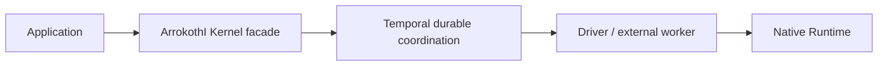
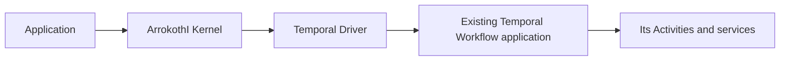

# ArrokothI and Temporal: integration choices and decisive experiments

Research date: 2026-09-22. Non-canonical proposals, all **TBD**. These are options for later evaluation, not selected dependencies or released implementation packets. [Report 1](temporal-01-architecture-comparison.md) records the source scope.

**Temporal should be both a direct-use baseline and a candidate durable substrate.** A separate, narrower possibility is treating a Temporal application as a native Runtime. Those choices solve different problems and should be evaluated independently.

This infrastructure comparison preserves the plan to build ArrokothI's own Agent and Workflow systems after the Kernel/Driver foundation. A Runtime in the placements below may be ours or an external framework. Reusing a durable substrate does not select the Agent loop, graph API, context strategy or memory design.

## Choose which layer Temporal would occupy

| Option | Placement and owner | Useful when | Principal burden |
|---|---|---|---|
| Direct Temporal application | Application implements Workflow/Activities and domain policy | The application already fits Temporal and needs no cross-Runtime contract | Application owns exact approval, policy, and external uncertainty handling |
| Temporal beneath an ArrokothI facade | Kernel transitions remain ArrokothI semantics; Temporal supplies durable orchestration | Reusing storage, timers, queues, and recovery materially reduces custom infrastructure | Prove atomic receipts, policy ordering, retry safety, and history/retention mapping |
| Temporal as a native Runtime | ArrokothI Kernel → Driver → existing Temporal application | One outer lifecycle/governance layer must coordinate Temporal alongside other engines | Define two lifetimes, input acknowledgment, run-chain mapping, and control ownership |
| Native Runtime inside a Temporal Activity or external operation | Temporal coordinates a Hermes/Dify/CrewAI-style service | Coarse start/result integration is enough | Native state and unrecorded tool effects still need their own recovery contract |

The fourth option is an important competing solution: an application may obtain enough value from Temporal plus its native framework without adding ArrokothI. The [native-integration contract](../../mental-model/mechanisms/integration.md) explicitly permits a shallow job boundary and requires comparison with direct use.

Conceptual placements:

These are logical responsibilities, not mandated processes or an implemented design.

## What a substrate prototype must establish

A plausible experiment is one durable coordinator Workflow per ArrokothI Execution, with deterministic transition logic and external Activities/adapters for native computation. This is a hypothesis, not a recommendation to move the current mutable coordinator wholesale into Workflow code.

The prototype needs answers to five concrete questions:

1. **Where is the acceptance receipt authoritative?** A repeated external request must return its original semantic disposition. Temporal task tokens or an RPC success alone are not substitutes for ArrokothI's scoped receipts and content-conflict rules.
2. **Which operations may the substrate repeat?** Classify Workflow replay, RPC delivery retries, Activity retries, native job retries, and provider retries separately. A native “start” Activity needs idempotent submission or reconciliation. A generic retry decorator around consequential dispatch is unsafe.
3. **Who orders policy changes and admission?** If they live in different stores or Workflows, that is a cross-boundary protocol to prove. A cached permission snapshot cannot promise immediate revocation. A physical retry must pass the required fresh admission even when the same logical action is retained.
4. **How do late results outlive closure?** ArrokothI requires accountable action evidence after terminal Execution state. A completed coordinator Workflow cannot be the only receiver of evidence unless a retained owner/route provides the required behavior.
5. **How are long histories bounded?** Run rotation must preserve logical Execution identity, deduplication windows, action obligations, input accounting, and inspection cursors. Continue-As-New is a native mechanism, not permission to silently forget these facts.

These obligations follow from [creation](../../mental-model/mechanisms/creation.md), [execution-cycle](../../mental-model/mechanisms/execution-cycle.md), [authority](../../mental-model/mechanisms/authority.md), [actions](../../mental-model/mechanisms/actions.md), and [recovery](../../mental-model/mechanisms/recovery.md). Temporal's [History Service][t-history] is relevant implementation evidence, but it does not establish that the proposed facade satisfies those contracts.

Use public Temporal SDK/service interfaces for the first experiment. Its persistence interfaces and CHASM are valuable implementation references; importing server internals would add coupling that this study has not justified.

## What a Temporal Driver must declare

Start with an outer job/result boundary. Keep the Temporal application's control flow, Activities, child Workflows, and recovery behavior native.

| Driver question | Required experiment or declaration |
|---|---|
| Identity | Map ArrokothI Execution/Activation to namespace, Workflow ID, Run ID or declared chain; pin start-request identity before submission |
| Input | Distinguish API receipt, delivery to Workflow code, and accepted ArrokothI input accounting |
| Progress | Name the durable native run/history boundary and compatible code; a Workflow ID alone does not prove resumability |
| Native waits | Translate only exposed Kernel-visible dependencies; internal Activity/timer waits need not become ArrokothI WAITING |
| Completion | Define which native terminal statuses close the enclosing logical work; handle Continue-As-New and configured retries explicitly |
| Cancellation | Separate request, native cancellation handling, termination, and evidence that external effects stopped |
| Actions | List which paths are mediated and which remain native; no implied governance of all Activities |
| Recovery | Explain reattachment, duplicate delivery, old-worker return, lost start acknowledgment, and missing native history |

Temporal's [Nexus implementation][t-nexus] is also relevant because it models synchronous and asynchronous operations with callbacks and cancellation. It broadens the comparison beyond ordinary Activities. Endpoint/version limitations must be verified for the selected SDK/server pair; the inspected internal document mixes architectural explanation with version-specific configuration. No universal external-Nexus support claim follows here.

Deep tool mediation should be attempted only when the application needs it. The Driver must yield an Outcome with the proposed Effect and a recoverable continuation before the Kernel admits the action. An unversioned direct tool RPC during an unresolved Activation would violate the current target protocol. [Mediated tool sequence](../../mental-model/mechanisms/integration.md#mediated-tool-sequence).

## A comparison that can reject our preferred design

Use the same public “draft, approve, publish” application in three implementations:

- Direct Temporal, including a competent application policy and uncertainty ledger.
- ArrokothI on one narrow transactional persistent path.
- ArrokothI on the selected mature substrate candidate.

Keep the Runtime, fake model, publishing API, inputs, approval UI contract, and external ledger equivalent. The publishing service should support two declared profiles: stable provider-enforced deduplication, and an unsafe control with no reliable deduplication/query. For the latter, holding as unknown is an expected safe result, not a recovery failure.

| Injected interruption | Independent observable result |
|---|---|
| Input committed, wake notification lost | Every accepted input remains accounted for; work eventually becomes schedulable |
| Native job starts, response/handle is lost | Find the same job through the committed identity or hold visibly; never invent a successful lookup |
| External publication succeeds, result is lost | No blind second publication; ledger preserves uncertainty or reconciles the first |
| Old host remains alive after ownership replacement | No stale accepted progress; native writer excluded or takeover refused |
| Outcome accepted, response lost | Same receipt and one set of logical action intents |
| Callback duplicated or arrives after cancellation | Evidence attributed to the original attempt; terminal Execution does not reopen |
| Approval revoked before dispatch admission | No newly admitted send; an already admitted send remains separately accountable |
| Checkpoint deleted while acceptance is delayed | No accepted reference to unusable continuation; explicit refusal/hold |
| Required code or native resource is missing | No silent restart with empty state or a substituted account |

For K3, use actual process kills with the store and external ledger surviving outside the killed processes. Exceptions inside one process are useful unit probes but do not establish the required failure claim. Add native-only versus thin-Driver fidelity cases under R1 rather than treating successful fake Workflow orchestration as native fidelity.

Measure accepted stale writes, lost input/wakes, duplicated external actions, unresolved obligations, and recovery latency first. Then measure database writes/bytes, retained history/checkpoints, native repeat cost, queue delay, cold recovery, and the application/operational code required. Compare identical guarantees; an in-memory path and a durable service are not a fair latency contest.

## How this fits the existing roadmap

| Existing owner | Research contribution | Status |
|---|---|---|
| K1/K2 | Clarify why acceptance, mediation, and admission remain separate | Canonical contracts already exist; this report adds no semantic change |
| R1/E3 | Temporal/native Driver identity, fidelity, and phase-specific recovery questions | Proposed evidence; no support claim |
| K3/E4 | Narrow transactional path versus one mature substrate, using the same process-fault fixture | Already required by roadmap; comparator remains unselected |
| K5 | Retention, rotation, unavailable code, inspection, and measured cost | Future evaluation |
| D1 | Containment if an isolated operating profile is claimed | Separate physical evidence |
| R2 and later native Runtime design | Our Agent/Workflow composition, context and recovery-unit choices, compared with a fixed Kernel | Proposed evidence; not an extra K1 entry condition |

The [K3 roadmap](../development/001-current-status-and-roadmap.md#k3--survive-process-death-choose-a-substrate) already requires this style of comparison and permits retiring custom infrastructure if a mature runtime is simpler. Current release/entry decisions remain with the [status ledger](../development/007-work-packets.md).

For a particular application, direct Temporal may meet the requirements with less total machinery. A substrate facade is useful only if ArrokothI adds reusable semantics while reducing infrastructure burden; a native Driver needs a real cross-engine requirement. These are application/infrastructure decisions, not a recommendation to abandon our native Agent/Workflow product. A failed prototype should narrow the claim, not justify more adapter layers by itself.

## Compare our native Agent and Workflow systems separately

The added Temporal SDK checkout includes an experimental Strands integration, making it a concrete later Agent comparison. Its replacement of native snapshots and retry behavior also demonstrates why feature preservation must be reported explicitly. [Report 4](temporal-04-other-candidates.md#temporal-sdk-the-agent-comparison-is-already-concrete) records the source evidence.

First hold Kernel fixed and vary our Runtime's context binding, typed local dataflow, branch handling and selected continuation mechanism. Then compare complete applications against direct framework use and Temporal with an appropriate Agent/Workflow implementation. Keep models, tasks and external services comparable, and disclose differences in persistence/retry policy. Measure verified task outcomes, lost corrections, duplicate actions, repeat cost and application code separately from infrastructure throughput.

The eight [mental-model proposals](temporal-04-other-candidates.md#proposed-changes-to-mental-model-for-later-review) are for reconsideration after the requested concept rewrite and next Kernel implementation. They neither modify canonical documents nor release new work.

[t-history]: https://github.com/temporalio/temporal/blob/543367eec690da3c23e536cf5dfe76928af11b2c/docs/architecture/history-service.md
[t-nexus]: https://github.com/temporalio/temporal/blob/543367eec690da3c23e536cf5dfe76928af11b2c/docs/architecture/nexus.md
