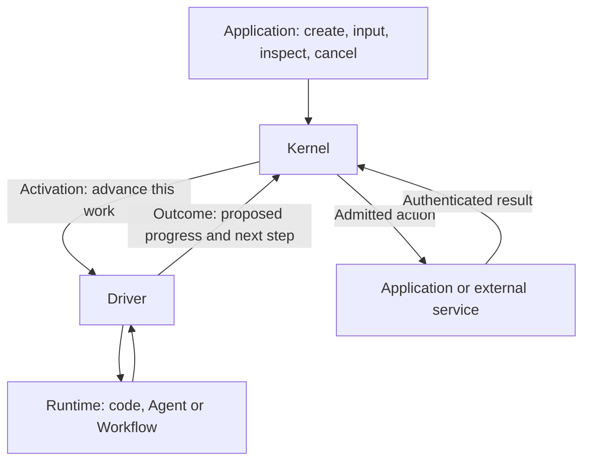

# ArrokothI: coordinating work without owning its algorithms

ArrokothI lets an application manage work performed by different agent frameworks, workflow engines or ordinary code. It gives that work a stable identity, records its accepted progress and coordinates the actions it asks the application to perform.

The central division is simple: **the Kernel manages execution; the Runtime decides how to do the work.** A Runtime can keep its own model loop, graph, tools and memory. Sharing this coordination layer is intended to reduce integration failures. Whether that is better than using a native framework directly remains a product question to test.

## Four pieces to remember

An [Execution](concepts/core.md#execution) is one independently managed piece of work, such as "prepare this report." The application decides its lifetime. A chat session can contain several Executions, whereas a whole multi-agent workflow can be one Execution.

The [Kernel](concepts/core.md#kernel) records what has been accepted for that Execution. The [Runtime](concepts/core.md#execution-runtime) performs its computation. The [Driver](concepts/core.md#execution-driver) adapts their communication to the Runtime's native API. A Driver can be a small function; it need not be another service.

*Native*, here and on every later page, means belonging to the Runtime's own framework or service rather than to ArrokothI: a native API, a native session, a native tool call. The Kernel never looks inside native work; the Driver is where the two meet.

An [Activation](concepts/core.md#activation) asks the Runtime to advance one Execution from a fixed set of inputs. The Runtime eventually submits an [Outcome](concepts/core.md#outcome): its proposed progress, output, requested actions and next step. The Kernel checks that proposal and then accepts all of it as one decision, or rejects all of it. Sending the Activation does not require the Kernel to wait for the computation to finish.

## Example: a report that needs publication

1. An application creates "prepare the weekly report" with its initial input.
2. The Kernel sends an Activation through the Driver. The Runtime gathers data, calls models and writes a draft using its own implementation.
3. To publish through an application-controlled service, the Runtime can propose an [Effect](concepts/actions.md#effect) in its Outcome — a request for the Kernel to mediate that action. The Runtime saves enough progress to continue in a later Activation, submits the Outcome, and asks to wait for the publication result.
4. Accepting this Outcome records the progress and the [action intent](concepts/actions.md#logical-action-and-intent) together. The Kernel then checks the exact action against current permissions and any required approval.
5. The service's authenticated result becomes an [Event](concepts/core.md#event), an accepted observation addressed to this Execution. A later Activation supplies it to the Runtime, which can account for the result and complete the report.

A UI can also observe accepted output without publishing it to an external destination. The [worked protocol trace](mechanisms/execution-cycle.md#worked-trace) adds identities, lost replies and retries when you need those details.

This example describes the target design. [Target, not shipped](#target-not-shipped) below says where to look for what exists today.

## What this arrangement guarantees

- **One accepted continuation at a time per Execution.** Several Executions may compute concurrently, but only one continuation for a given Execution can remain current. For example, if one Runtime attempt becomes disconnected and a replacement attempt takes over the same Execution, the old attempt may later reconnect and return a result. That late result cannot overwrite the state accepted from the current attempt.
- **Progress and requested actions agree.** Accepting an Outcome records its progress and action intents together. External actions happen later; there is no rollback transaction spanning arbitrary services.
- **Accepted input is accounted for.** An early result is retained until it can be handled. Reading input is distinct from acknowledging that the Runtime accounted for it.
- **Recovery has two parts.** If the deployment keeps the Kernel's accepted state in storage that survives a process restart, the Kernel can restore the accepted state of an Execution after that restart. Separately, the Driver must establish whether the Runtime's native work can safely continue. The Kernel does not own the Runtime's internal state; it interacts with the Runtime through the Driver. If safe continuation cannot be established, recovery should be held visibly rather than guessed.
- **Permissions apply to mediated actions.** Native tools with ambient filesystem or network access remain the deployment's responsibility. Physical isolation requires actual containment, independently of the Kernel's action checks.

Completing an Execution records its result. It does not prove that a user received it, that every remote process stopped, or that an unknown external action failed. Those facts are tracked separately and require their own evidence.

## Logical pieces and physical deployment

The diagram describes responsibilities, not machines. One backend process can run the Kernel, Driver and Runtime together. Another deployment can run Runtime code on a separate host while keeping accepted state in a persistent store. A process can host many Executions. Moving a box to another process does not automatically make its state durable or its actions safe to retry.

Applications own user identity, business policy, resources and UI. Runtimes own model calls, graph steps, context and memory. Add a Kernel concept only when the Kernel needs it to uphold a coordination guarantee; useful internal Runtime features can stay internal.

## Continue reading

Read the major abstractions in this order. Each page ends by pointing at the next one.

1. [Kernel](kernel.md): how accepted state coordinates work.
2. [Runtime](runtime.md): how computation stays native.
3. [Driver](driver.md): what translation and recovery must preserve.
4. [Deployment](deployment.md): where code runs and which guarantees a profile can claim.

After those four, the exact vocabulary begins with the [concept reading path](concepts/README.md#reading-path), and the interacting rules follow in the [mechanism reading path](mechanisms/README.md). You do not yet need to know the identity fields, wait selector grammar or checkpoint publication protocol; those pages teach them where they become useful. If you already know the architecture and want one term or rule, the [reference index](reference.md) names its owner.

## How these pages are organized

Three layers, from least to most detail. Other documents refer to them by number.

| Layer | Pages | What it does | Change it when |
|---|---|---|---|
| 1 | this page | One deliberately incomplete picture of the whole system | The whole-system model changes |
| 2 | [kernel](kernel.md), [runtime](runtime.md), [driver](driver.md), [deployment](deployment.md) | One major abstraction each, at reading depth | A major abstraction changes |
| 3 | everything under `concepts/` and `mechanisms/` | Each term defined once; each interaction specified once | Accepted work changes a rule |

Layers 1 and 2 summarize Layer 3. They are not second places to state a rule, so when they disagree with a Layer-3 page, the Layer-3 page is right and the summary is the defect.

Three pages sit outside the layers because they are navigation rather than specification: the [reference index](reference.md) points at owners, [sources](sources.md) records where the rules came from and what is still undecided, and the [roadmap mapping](roadmap.md) says which Layer-3 pages a given piece of accepted work is expected to maintain.

**No page in these layers records current build or acceptance status.** A specification page states a contract and names the gate that introduces it. Whether that contract has been implemented, independently accepted or integrated is a different and much faster-moving fact, owned by two documents under `docs/development/`: the [status ledger](../docs/development/007-work-packets.md) records what each packet has had independently accepted and what has been integrated, and the [implemented baseline](../docs/development/002-implemented-kernel-baseline.md) lists the API surface that exists today. The navigation pages may record provenance — which decision a rule came from, which packet is expected to maintain which page — but for the current state of any of it they defer to those two.

This is a single-owner rule for the same reason each term is defined once. A status sentence copied onto a specification page reads as helpful on the day it is written, and nothing in the page's own subject reveals it later when the status moves. If you find yourself adding "accepted", "implemented" or a commit identity to a page under `concepts/` or `mechanisms/`, it belongs in the ledger or the baseline instead.

## Target, not shipped

Everything in these pages is specification. Each Layer-3 mechanism page carries a **Status** line naming the kind of obligation it states and the development gate that introduces it; concept pages carry none. [How pages are named](reference.md#how-pages-are-named) owns that convention. Those gates — K1, K2, R1 and so on — are the milestones in the [development roadmap](../docs/development/001-current-status-and-roadmap.md).

**A gate named on a page is the contract for that gate, not a claim that the gate has shipped.** Some of this is built and some of it is not, and the split moves. Check the ledger and the baseline named above before relying on anything here, and keep their two facts apart: work can be independently accepted for some time before it is integrated.

For rough orientation, and in terms of which gate owns what rather than what has shipped: K0.1 settles the protocol decisions and K0.2 the public controls; K1.0 prepares a private target package whose structure carries none of the protocol; the first protocol boundaries in that package — creation, input ingress, batch reservation and asynchronous dispatch — are K1.1's. Outcome acceptance, waits and cancellation, Effects, persistence, composition, real Drivers and operability belong to later gates. That private package is not the supported surface — current application users start from the [guides](../docs/guides/README.md), which describe the existing 0.8.x SDK.
