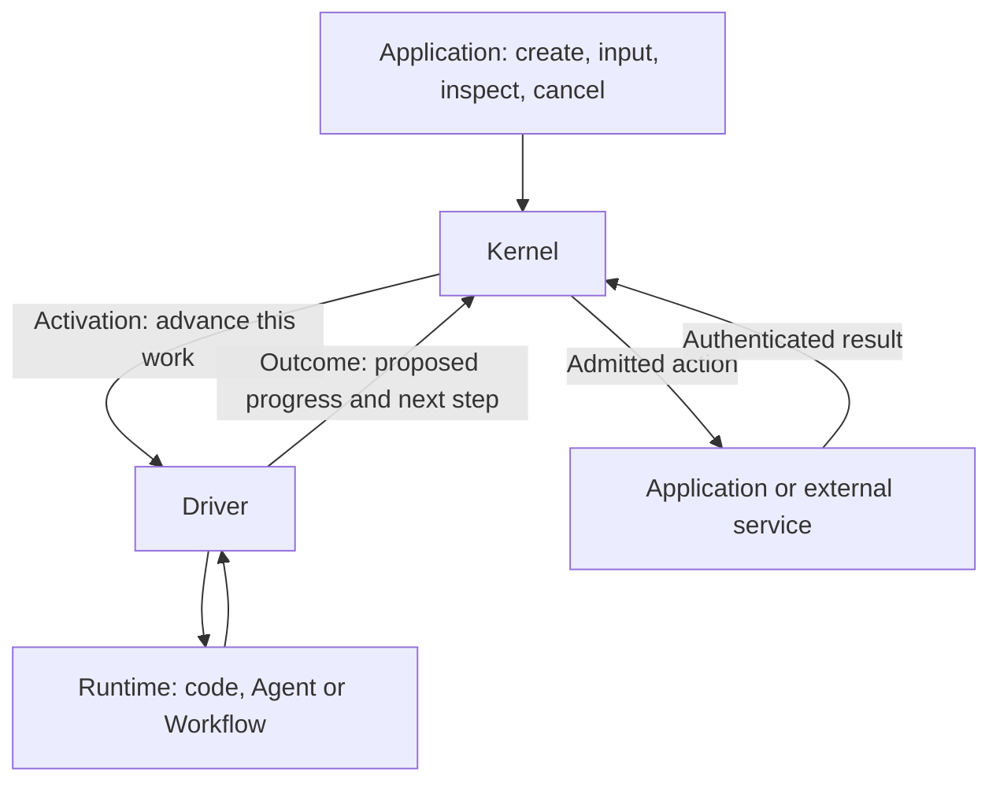

# ArrokothI: coordinating work without owning its algorithms

ArrokothI lets an application manage work performed by different agent frameworks,
workflow engines or ordinary code. It gives that work a stable identity, records its
accepted progress and coordinates the actions it asks the application to perform.

The central division is simple: **the Kernel manages execution; the Runtime decides
how to do the work.** A Runtime can keep its own model loop, graph, tools and memory.
Sharing this coordination layer is intended to reduce integration failures. Whether
that is better than using a native framework directly remains a product question to test.

## Four pieces to remember

An [Execution](concepts/core.md#execution) is one independently managed piece of work,
such as “prepare this report.” The application decides its lifetime. A chat session
can contain several Executions; a whole multi-agent workflow can be one Execution.

The [Kernel](concepts/core.md#kernel) records what has been accepted for that Execution.
The [Runtime](concepts/core.md#execution-runtime) performs its computation.
The [Driver](concepts/core.md#execution-driver) adapts their communication to the Runtime's
native API. A Driver can be a small function; it need not be another service.

An [Activation](concepts/core.md#activation) asks the Runtime to advance one Execution
from a fixed set of inputs. The Runtime eventually submits an
[Outcome](concepts/core.md#outcome): its proposed progress, output, requested actions
and next step. The Kernel checks and accepts that proposal as one decision.
Sending the Activation does not require the Kernel to wait for the computation to finish.

## A report that needs publication

1. An application creates “prepare the weekly report” with its initial input.
2. The Kernel sends an Activation through the Driver. The Runtime gathers data,
   calls models and writes a draft using its own implementation.
3. To publish through an application-controlled service, the Runtime proposes an
   [Effect](concepts/actions.md#effect)—a request for the Kernel to mediate that action.
   It saves enough progress to continue and asks to wait for the publication result.
4. Accepting this Outcome records the progress and action intent together. The Kernel
   then checks the exact action against current permissions and any required approval.
5. The service's authenticated result becomes an [Event](concepts/core.md#event), an
   accepted observation addressed to this Execution. A later Activation supplies it
   to the Runtime, which can account for the result and complete the report.

This example deliberately uses the full target design. K1 initially refuses Effects;
K2 introduces them. A UI can also observe accepted output without publishing it to an
external destination. The [worked protocol trace](mechanisms/execution-cycle.md#worked-trace)
adds identities, lost replies and retries when you need those details.

## What this arrangement guarantees

- **One accepted continuation at a time per Execution.** Several Executions may compute
  concurrently. A late response from replaced work cannot overwrite current accepted state.
- **Progress and requested actions agree.** Accepting an Outcome records its progress and
  action intents together. External actions happen later; there is no rollback transaction
  spanning arbitrary services.
- **Accepted input is accounted for.** An early result is retained until it can be handled.
  Reading input is distinct from acknowledging that the Runtime accounted for it.
- **Recovery is explicit.** A persistent deployment reconstructs accepted records after
  process loss. Continuing native work additionally requires the Driver to establish
  that it can reattach or repeat the work safely. If it cannot, recovery is held visibly.
- **Permissions apply to mediated actions.** Native tools with ambient filesystem or
  network access remain the deployment's responsibility. Physical isolation requires
  actual containment, independently of the Kernel's action checks.

Completion records the Execution's result. It does not prove that a user received it,
that every remote process stopped, or that an unknown external action failed. Those
facts keep their own owners and evidence.

## Logical pieces and physical deployment

The diagram describes responsibilities, not machines. One backend process can run the
Kernel, Driver and Runtime together. Another deployment can run Runtime code on a
separate host while keeping accepted state in a persistent store. A process can host
many Executions. Moving a box to another process does not automatically make its state
durable or its actions safe to retry.

Applications own user identity, business policy, resources and UI. Runtimes own model
calls, graph steps, context and memory. Add a Kernel concept only when the Kernel needs
it to uphold a coordination guarantee; useful internal Runtime features can stay internal.

## Continue reading

Read the major abstractions in this order:

1. [Kernel](kernel.md): how accepted state coordinates work.
2. [Runtime](runtime.md): how computation stays native.
3. [Driver](driver.md): what translation and recovery must preserve.
4. [Deployment](deployment.md): where code runs and which guarantees a profile can claim.

Then use the [reference index](reference.md) to look up a term or a mechanism. Definitions
live under `concepts/`; interacting rules live under `mechanisms/`. You do not yet need
to know the identity fields, wait selector grammar or checkpoint publication protocol.
Those pages teach them where they become useful.

These are target specifications, not a declaration that the target has shipped. K0.1
settled protocol decisions, K0.2 supplied public controls, and K1.0 prepared a private,
refusal-only target package. See the [implemented baseline](../docs/development/002-implemented-kernel-baseline.md)
for actual APIs and the [status ledger](../docs/development/007-work-packets.md) for acceptance
and release. Current application users start from the [guides](../docs/guides/README.md).
