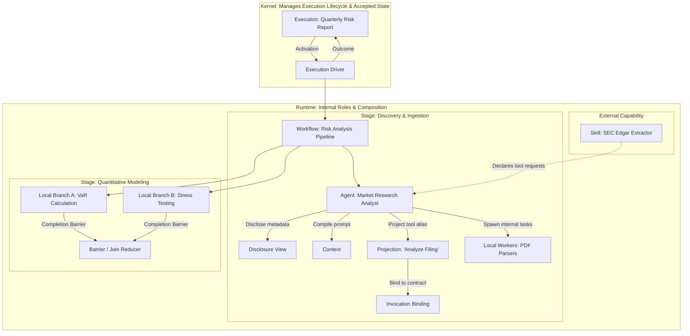
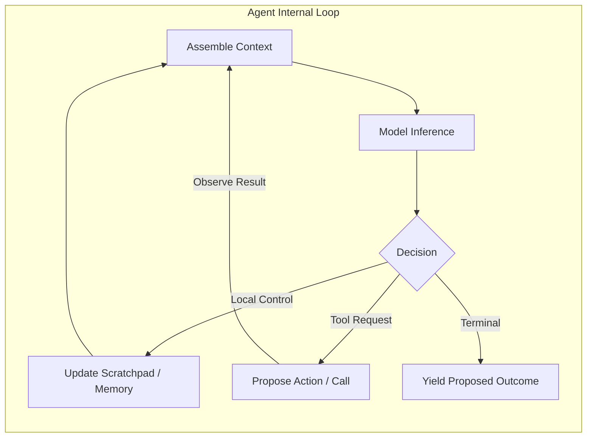
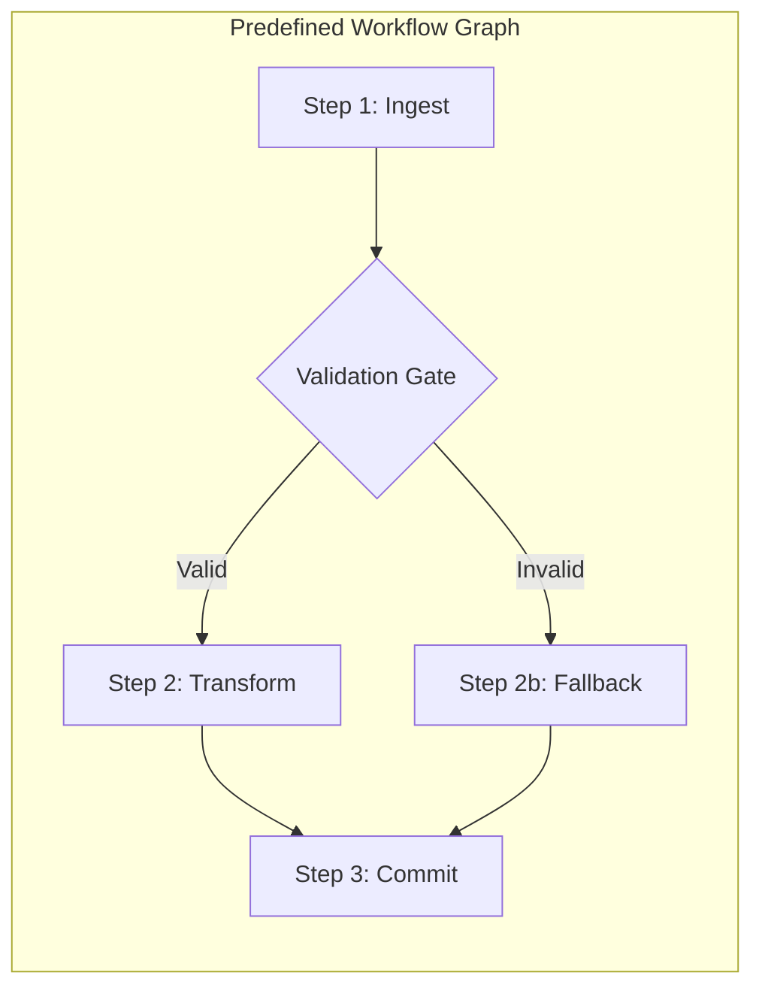
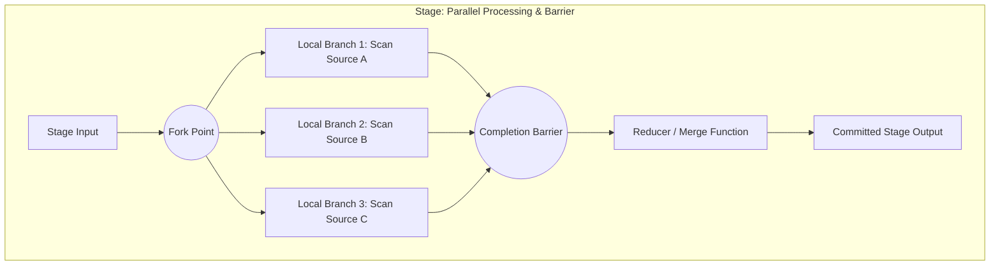
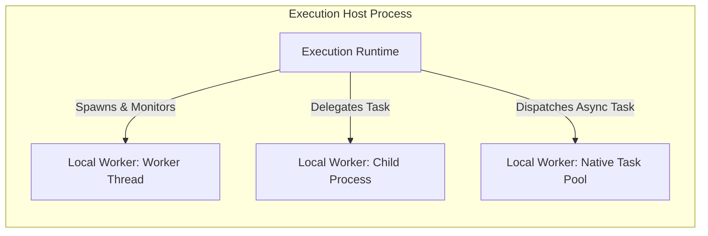
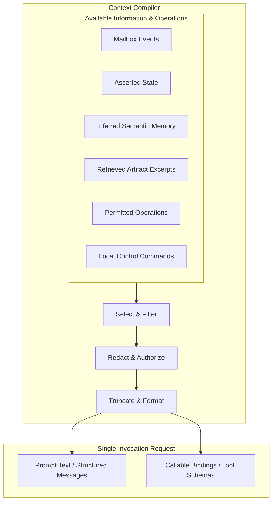
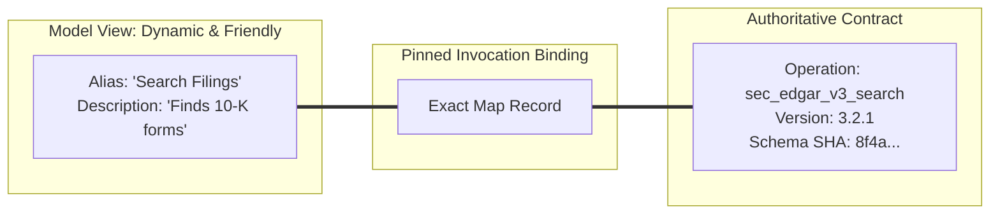
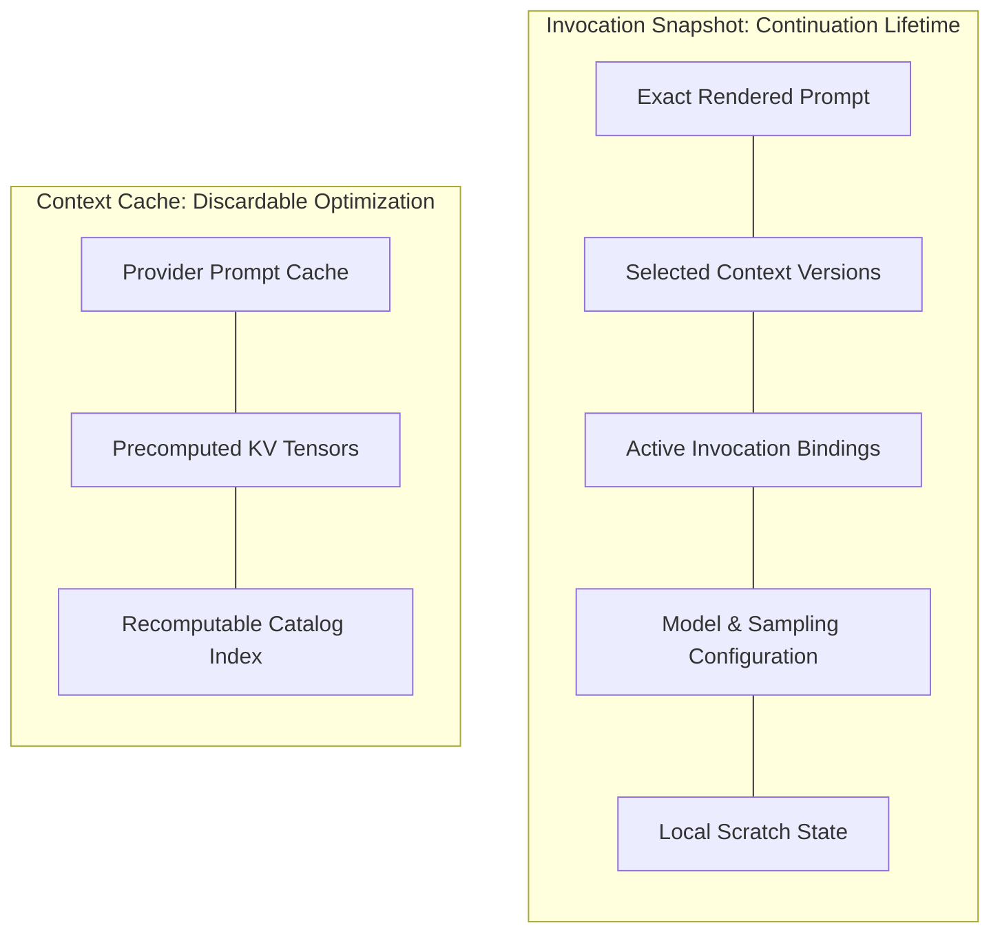
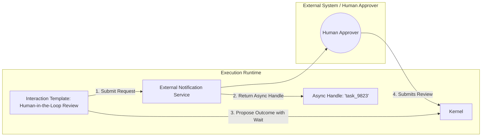

# Runtime roles and context vocabulary

The [core coordination vocabulary](core.md) defines the boundary managed by the [Kernel](core.md#kernel): [Executions](core.md#execution), [Activations](core.md#activation), [Outcomes](core.md#outcome), and [Events](core.md#event). This page defines the internal architecture, design patterns, and context mechanisms that operate inside an [Execution Runtime](core.md#execution-runtime).

The central rule governing every concept on this page is simple: **a Runtime-internal structure has no Kernel mailbox, no Kernel authority, and no Kernel lifecycle.** The Kernel coordinates and records accepted state across Executions; the Runtime decides how to organize, compute, decompose, and prompt its own internal work.

Keeping that separation strict is what allows ArrokothI to coordinate arbitrary programs without forcing them into a single framework. A Runtime may be a fifty-line deterministic script, an autonomous multi-step agent, a hierarchical workflow, or a complex distributed pipeline. To the Kernel, all of them look identical: an opaque computation that receives an Activation, runs inside a private boundary, and proposes an Outcome.

The concepts on this page fall into three natural groups:

- **How a Runtime is shaped** — [Agent](#agent), [Workflow](#workflow), [Stage and local branch](#stage-and-local-branch), and [Local worker](#local-worker): the architectural patterns used to organize computation inside an Execution.
- **What a Runtime shows a model and how it reads the reply** — [Context](#context), [Projection and invocation binding](#projection-and-invocation-binding), and [Invocation snapshot and cache](#invocation-snapshot-and-cache): the mechanics of assembling information for a reasoning model, preserving the meaning of callable tools, and retaining intermediate attempt state.
- **What a Runtime is allowed to see and to package** — [View and disclosure](#view-and-disclosure), [Skill and package](#skill-and-package), and [Service and interaction template](#service-and-interaction-template): the boundaries governing visibility, reusable capability bundles, and backing services.

---

## A first example

Consider an investment research application tasked with generating a comprehensive quarterly portfolio risk analysis. The application creates an [Execution](core.md#execution) to track this unit of work from start to finish.



The application configures a **Workflow** to enforce a regulated three-step pipeline: document discovery, quantitative risk calculation, and compliance review. Each major phase runs as a distinct **Stage**.

In the discovery stage, the Workflow invokes an **Agent**. The Agent uses a large language model to read market news, identify relevant SEC filings, and decide dynamically which data sources require deeper inspection. To feed the model, the Runtime compiles a **Context** window containing current market events and excerpts of previous analyses. To protect sensitive data, it applies a **disclosure view** that redacts unreleased client positions.

When presenting tools to the model, the Runtime uses a **projection**: the complex underlying operation `sec_edgar_v3_query` is displayed to the model under the readable alias `"Search SEC Filings"`. The Runtime records an **invocation binding** associating that exact alias and schema version with the model request, and preserves an **invocation snapshot** in case the attempt needs to be evaluated or retried.

To parse ten large filings at once, the Agent spins up ten **local workers** in a background worker pool. These workers run in parallel within the Runtime process. They have no Kernel identities and no mailboxes; if one fails, the Agent handles the retry privately.

Once the filings are extracted, the Workflow transitions to the quantitative modeling stage. It creates two concurrent **local branches**: one calculating Value-at-Risk (VaR) and another executing historical stress tests. Both branches compute concurrently in memory. A strict **completion barrier** ensures that both branches finish and merge their calculated numerical matrices before the Workflow initiates the compliance review stage.

The entire system also imports a third-party **Skill** package containing SEC extraction routines. The Skill manifest requests access to the filing query operation. The application checks its own security policy, validates the manifest, and grants the tool binding.

Throughout this entire sequence, the Kernel has seen only one Execution. It dispatched an Activation, delivered input Events, and received proposed Outcomes. It did not track the Agent's reasoning loops, the Workflow's stage transitions, the local workers' thread lifecycles, or the Skill's internal code. The boundary held completely.

---

## Agent

An **Agent** is a Runtime organization pattern where an autonomous reasoning model directs its own control flow dynamically at runtime based on incoming observations, prompt context, and intermediate tool results.



In an Agent pattern, the sequence of computational steps is not hard-coded into a script or fixed in a graph. Instead, an LLM evaluates the current problem state, selects actions from an exposed catalog of tools, inspects the observations produced by those actions, and decides whether to continue investigating, adjust its approach, or conclude its task.

Agents are powerful for open-ended problem solving, exploratory data analysis, unstructured information extraction, and conversational workflows where user intent cannot be predicted in advance. However, this dynamic autonomy introduces specific coordination and safety challenges:

1. **Unpredictable Step Counts:** An agent may converge on a solution in one step or enter an exploratory loop lasting dozens of turns.
2. **Nondeterministic Tool Invocations:** An agent may select different tools, provide different argument structures, or query unexpected external resources across identical runs.
3. **Drift and Hallucination:** Without structural guardrails, an agent's internal reasoning can drift away from the original goal over extended conversational turns.

### The Boundary Between the Agent and the Kernel

The Kernel is completely agnostic to whether a Runtime uses an Agent, a hardcoded function, or a workflow engine. To prevent dangerous architecture confusion, the following boundaries must be held:

- **An Agent is not a Kernel type.** The Kernel does not have an `Agent` entity, does not record "agent thoughts", and does not manage agent personas. An Agent is merely an implementation choice inside an Execution Runtime.
- **An Agent turn is not an Activation.** An Agent might run ten internal LLM reasoning cycles and execute five local helper functions inside a single [Activation](core.md#activation). Conversely, an Agent that initiates a mediated action requiring human approval will yield an [Outcome](core.md#outcome), pause its execution, and resume in a second Activation when the approval Event arrives.
- **An Agent is not a Principal.** An Agent has no identity in the security model. It cannot authorize actions, grant itself permissions, or bypass Kernel policy. Every action an Agent proposes must be admitted under the Execution's bounded [authority](actions.md#principal-and-authority).
- **A waiting Agent is not `WAITING`.** When an Agent blocks while waiting for an external LLM API HTTP response, the Execution remains `RUNNING` in the Kernel's state machine. The Kernel state `WAITING` is reserved exclusively for Executions that have concluded an Activation and registered a formal [wait subscription](core.md#wait-subscription-and-generation) with the Kernel.

### Multi-Agent Cooperations

When multiple agents collaborate (for example, a "Researcher Agent" feeding a "Critic Agent" and a "Writer Agent"), they can be organized in two distinct ways:

- **Internal Multi-Agent Runtime:** All agents run inside the same Runtime process as local software routines. They pass data through local memory and share a single Execution lifecycle. The Kernel sees only one Execution.
- **Hierarchical Executions:** Each agent runs as an independent [child Execution](operations.md#child-and-ownership) coordinated by the Kernel. Each child has its own isolated state, independent authority envelope, and addressable mailbox.

The decision depends on isolation requirements: internal agents are cheap, fast, and share memory; child Executions provide fault isolation, independent auditing, distinct authority boundaries, and independent recovery.

---

## Workflow

A **Workflow** is a Runtime organization pattern where control flow follows a predefined, structured graph of discrete computational steps, transitions, decision branches, and completion barriers.



Unlike an Agent, a Workflow fixes the topology of its execution in code or configuration before execution begins. State transitions follow explicit conditional branches, state machines, directed acyclic graphs (DAGs), or procedural pipelines.

Workflows are the foundation of deterministic business logic, regulatory compliance processes, financial transactions, and reliable data processing. They excel where auditability, strict ordering, and deterministic failure recovery are mandatory.

### Blended Agentic Workflows

Modern AI architectures frequently combine Workflows and Agents into hybrid structures:

- **Agent-within-a-Node:** A Workflow manages the top-level business pipeline (e.g., Ingest $\rightarrow$ Analyze $\rightarrow$ Approve $\rightarrow$ Publish), but embeds an autonomous Agent inside the "Analyze" step to process unstructured input.
- **Workflow-as-a-Tool:** An autonomous Agent orchestrates top-level exploration, but invokes deterministic Workflows as atomic tools to execute sensitive or multi-step operations reliably.
- **Model-Directed Routing:** A Workflow uses an LLM at a specific decision diamond to classify input and choose between predefined branches, while keeping the downstream execution path strictly deterministic.

### Sagas and Compensation

When a multi-step Workflow encounters a terminal failure midway through its graph, it cannot simply "roll back" external world history. Instead, the Workflow must execute a **saga**: a sequence of compensating actions designed to neutralize the effects of previously completed steps (e.g., canceling a hotel reservation after a flight booking fails).

Saga coordination belongs entirely to the Workflow logic inside the Runtime. The Kernel accepts and records individual mediated [Effects](actions.md#effect), but the Kernel does not understand the business semantics of a multi-step saga and will never automatically synthesize a compensating action on its own.

### Conflations to Avoid

- **A Workflow graph node is not an Execution.** A node is an internal programming construct. Breaking a workflow into twenty nodes does not create twenty Kernel Executions.
- **Workflow state is not Kernel state.** The Workflow tracks business-level progress (e.g., `step: "awaiting_kyc"`, `risk_score: 42`) within its private [progress](state.md#progress) structure. The Kernel tracks only the five universal coordination states (`CREATED`, `RUNNING`, `WAITING`, `COMPLETED`, `FAILED`).

---

## Stage and local branch

A **Stage** is a distinct, named phase within a Workflow or multi-step Agent representing a coherent milestone of work. A **local branch** is a concurrent lane of execution spawned inside a Runtime to perform parallel computations within a single Stage.



Stages and local branches provide structured concurrency inside a single Runtime instance. They allow an Execution to split heavy processing across multiple cores or asynchronous tasks, collect partial results, and synchronize before moving forward.

### Completion Barriers

A **completion barrier** is an explicit synchronization boundary at the end of a Stage. The Runtime must not transition to the next Stage or propose an Outcome until every local branch participating in the barrier has reached a terminal condition (success, handled failure, or explicit cancellation).

Relying on implicit function returns without a barrier is a major source of concurrency bugs: a Stage might fire off three background promises and immediately return, causing late-arriving results from the first Stage to corrupt the memory or assumptions of the second Stage.

### Concurrency and the Single-Writer Invariant

One of the most critical invariants in ArrokothI is the relationship between Kernel single-writer fencing and Runtime concurrency:

> **Kernel single-writer acceptance does not serialize native shared mutation.**

The Kernel uses the [writer epoch](identity.md#writer-epoch) to ensure that only *one authorized attempt* can commit accepted progress for an Activation. However, inside that attempt, if a Runtime launches three local branches that all attempt to mutate the same in-memory object, write to the same temporary file, or update the same database row without coordination, they will corrupt each other's state.

To safely execute concurrent local branches, a Runtime must follow five rules:

1. **Immutable Branch Inputs:** Capture snapshot-isolated input values for each branch at the fork point.
2. **Isolated Scratch Frames:** Provide each branch with its own private [working notes](state.md#working-notes) or memory frame so intermediate writes never collide.
3. **Branch-Qualified Keys:** Qualify temporary state keys with branch and iteration identifiers (e.g., `branch_a_step_2_scratch`).
4. **Declared Join Order:** Collect results at the completion barrier in a deterministic, declared order, regardless of which branch completed first in physical time.
5. **Explicit Reducer Functions:** Merge branch outputs using an explicit reducer function that resolves conflicting claims before committing Stage output.

### Local Branches vs Child Executions

| Dimension | Local Branch | Child Execution |
|---|---|---|
| **Boundary** | Internal Runtime memory / thread | Independent Kernel-managed lifetime |
| **Identity & Mailbox** | None (invisible to Kernel) | Dedicated Execution ID & Mailbox |
| **Authority** | Inherits host process environment | Distinct, narrowed delegation envelope |
| **Fault Isolation** | Process crash destroys all branches | Child failure can be supervised/handled |
| **Recovery** | Recovered as part of parent progress | Independently recovered and scheduled |
| **Coordination Cost** | Nanoseconds / Microseconds | Protocol round-trip via Kernel |

---

## Local worker

A **Local worker** (or delegated worker) is an internal task runner, thread pool, subprocess, or background routine managed entirely inside the Runtime to perform delegated computational work.



Local workers handle CPU-bound transformations (e.g., tokenization, matrix multiplication, image resizing, document parsing) or ephemeral I/O tasks that do not warrant the overhead of a distinct Kernel Execution.

### Disambiguating the Four "Workers"

The term *worker* is heavily overloaded in distributed systems. ArrokothI draws four unambiguous boundaries:

```
┌────────────────────────────────────────────────────────────────────────┐
│ 1. Kernel Worker                                                       │
│    A service or process that executes Kernel state transitions,        │
│    evaluates wait eligibility, and accepts Outcomes.                   │
├────────────────────────────────────────────────────────────────────────┤
│ 2. Execution Host                                                      │
│    The physical machine, virtual instance, or container where Runtime  │
│    code runs.                                                          │
├────────────────────────────────────────────────────────────────────────┤
│ 3. Local Worker                                                        │
│    An internal thread, subprocess, or routine spawned by a Runtime     │
│    to execute sub-tasks within one Execution's private memory.         │
├────────────────────────────────────────────────────────────────────────┤
│ 4. Child Execution                                                     │
│    A distinct, addressable Execution managed by the Kernel under       │
│    parent supervision.                                                 │
└────────────────────────────────────────────────────────────────────────┘
```

### Opacity and Failure Modes

Because local workers are internal to the Runtime, they are completely invisible to the Kernel. This opacity has direct operational consequences:

- **No Kernel Scheduling:** The Kernel cannot distribute local workers across cluster nodes, throttle their CPU usage, or monitor their heartbeats.
- **No Kernel Recovery:** If a local worker crashes or deadlocks, the Kernel cannot restart it. The enclosing Runtime must implement its own timeouts, try/catch blocks, and worker pool supervision.
- **Activation Lifecycle Fate:** If an unhandled error in a local worker crashes the Runtime process, the current Activation attempt fails. When the Execution is recovered, the Runtime must reconstruct its state from the last accepted Kernel [progress](state.md#progress) checkpoint.

---

## Context

**Context** is the structured assembly of information — selected events, conversation transcript slices, state snapshots, retrieved knowledge excerpts, and active callable tool definitions — compiled by the Runtime to execute a single model inference or computation step.



A reasoning model does not have direct access to an Execution's database, mailbox, or historical log. The Runtime must actively compile the world into a finite window of tokens. The component performing this job is the **context compiler**.

### The Two Selection Tasks

Compiling context involves two completely different selection problems that feed into a single model request:

1. **Information Selection (What the model may see):** Selecting, retrieving, summarizing, and formatting the data, history, and instructions presented in the prompt.
2. **Callable Selection (What the model may call):** Selecting, filtering, and projecting the tools, operations, and local controls made available for invocation.

These two tasks must be kept conceptually distinct because they fail in opposite ways: information selection fails when information status is corrupted; callable selection fails when invocation bindings drift.

### Selection Without Status Corruption

When the context compiler condenses large volumes of data into a prompt, it is permitted to summarize, shorten, reorder, and redact. **It is never permitted to alter the epistemic status of the data.**

- **Inferences vs Assertions:** An unverified claim extracted by an LLM in a previous turn ([derived semantic memory](state.md#derived-semantic-memory)) must never be presented to the model as an established factual assertion ([structured state](state.md#structured-state)).
- **Truncation vs Absence:** If a document search returns fifty results but only three fit in the token budget, the context compiler must include an explicit truncation marker. It must never allow the prompt to imply that only three documents exist in reality.
- **Relevance is Not Trust:** Just because a piece of retrieved text has a high vector similarity score does not make it authoritative.

### Local Control vs Mediated Action

Inside the callable tool list, a Runtime frequently includes internal directives alongside external operations:

- **Local Control:** A command that operates entirely inside the Runtime's private loop (e.g., `set_scratchpad_note`, `switch_reasoning_mode`, `request_more_search_results`). It requires no Kernel mediation and touches no external world state.
- **Mediated Operation:** A declared contract that executes an external business effect (e.g., `send_email`, `charge_card`, `commit_database_record`). It must be submitted to the Kernel as an [Effect intent](actions.md#logical-action-and-intent) inside an Outcome.

Even if both types of commands share identical JSON schema syntax in the model provider's API, the Runtime must maintain their **typed origin**. A local control must never masquerade as an admitted Kernel operation, and an untrusted model call must never trigger a mediated operation without Kernel admission.

### Context vs Execution History

- **Context** is ephemeral, lossy, subjective, and optimized for model comprehension. It is discarded or recompiled on every turn.
- **Execution History** is durable, immutable, objective, and owned by the Kernel. It records the authoritative sequence of accepted transitions, Events, and Outcomes.

---

## Projection and invocation binding

A **Projection** (or callable alias) is a presentation layer that exposes an operation, tool, or data schema to a model under a friendly name, localized description, or domain-specific label. An **Invocation binding** is the pinned, immutable association between that projected alias and the canonical, versioned [operation](actions.md#operation) identity.



Models reason best when tool names and parameter descriptions are clear, concise, and tailored to the immediate task. However, enterprise systems require stable, globally unique, version-controlled operation identifiers (`com.acme.finance.sec.query.v3`).

A projection bridges this gap by mapping canonical operations into model-friendly aliases.

### The Stale Catalog Dilemma

In long-running or asynchronous systems, tool catalogs evolve. Operations are upgraded, schemas change, and aliases are reassigned. This creates a severe failure mode:

1. At time $T_0$, the Runtime compiles a prompt containing alias `"query"` pointing to `search_database_v1`.
2. The prompt is sent to a model provider or queued for human review.
3. At time $T_1$, the system catalog updates: `"query"` is reassigned to `search_vector_store_v2`.
4. At time $T_2$, the model's tool call arrives requesting an invocation of `"query"`.

If the Runtime resolves the tool call against the *current* catalog at $T_2$, it will execute `search_vector_store_v2` using arguments structured and validated for `search_database_v1`. This results in silent data corruption, validation crashes, or unauthorized actions.

### The Invocation Binding Rule

To eliminate this vulnerability, the Runtime must enforce the **invocation binding rule**:

> **A delayed or asynchronous tool reply must resolve through the exact invocation binding that was presented when the prompt was generated, never through the latest catalog.**

When compiling a prompt, the Runtime pins an immutable map linking every projected alias to its exact canonical operation identity and version. When a tool call returns, resolution looks up that pinned map. If the binding cannot be reconstructed, the Runtime must refuse the invocation rather than guessing against a newer catalog.

### Projection is Not Authorization

Displaying an operation projection in a model prompt is merely an act of [exposure](actions.md#exposure-and-mediation). It does not grant authority. When the model invokes the projected tool, the resulting action must still pass Kernel admission checks against the Execution's active policy grants.

---

## Invocation snapshot and cache

An **Invocation snapshot** is an immutable record capturing the complete state of a model invocation attempt. A **Context cache** (or prompt cache) is a performance optimization that retains pre-computed token representations across calls.



Both concepts involve storing data related to model interactions, but they serve fundamentally different purposes and have completely different lifetimes.

### Continuation Lifetime vs Discardable Optimization

The difference between a snapshot and a cache lies in what happens when the data is lost:

- **Invocation Snapshot (Continuation Lifetime):** A snapshot is essential for correctness. If a network blip occurs during an LLM call or a host process crashes while waiting for a response, the Runtime needs the snapshot to evaluate whether the incoming reply matches the in-flight attempt, retransmit safely, or audit what the model saw. Dropping a snapshot breaks continuation and recovery.
- **Context Cache (Discardable Optimization):** A cache is purely an acceleration mechanism designed to reduce latency, bandwidth, and token costs. If a prompt cache is evicted, dropped, or corrupted, the system experiences a performance penalty, but correctness is unaffected because the prompt can be recomputed from source data.

### Cache Freshness and Authority Invalidation

A context cache stores compiled text or embeddings derived from source documents. If access permissions change, caching can create severe security leaks:

- **Permission Revocation:** If a user's access to "Project Titan" documents is revoked, any cached context containing summaries or embeddings of Project Titan must be invalidated immediately. Reusing a prompt cache across permission boundaries violates [disclosure](#view-and-disclosure) policy.
- **Freshness Verification:** When reusing a cached context across Activations, the context compiler must verify that the underlying [revisions](identity.md#revision) of the source documents and policies have not changed.

---

## View and disclosure

A **View** (or execution view) is a filtered, authorized projection of Execution state, output streams, or metadata tailored for a specific audience. **Disclosure** is the deliberate, policy-governed act of exposing authorized metadata, descriptors, or state fragments across a boundary.

```mermaid
flowchart LR
  subgraph Full Execution State [Authoritative Execution State]
    SEC[Internal Secrets & Keys]
    PII[Customer Personal Data]
    BUS[Business Calculations]
    EVT[Event Log & History]
  end

  subgraph Policy Filter [Disclosure Policy Engine]
    PF{Evaluate Audience & Scope}
  end

  Full Execution State --> Policy Filter

  Policy Filter -->|Authorized Public View| V1[UI Dashboard View: Redacted & Friendly]
  Policy Filter -->|Authorized Model View| V2[Model Context: Filtered & Scoped]
  Policy Filter -->|Authorized Audit View| V3[Compliance Auditor: Full Evidence]
```

Not all observers should see all aspects of an Execution. A human user watching a progress bar in a web UI needs friendly status messages; a reasoning model needs focused domain context; an internal security auditor needs cryptographic receipts and raw action parameters.

### Scope Labels Locate; They Do Not Grant

A common architectural error is using scope labels (e.g., `scope: "finance:read"`, `tag: "confidential"`) as if they were self-enforcing access tokens.

ArrokothI establishes that **scope labels locate data; they do not grant access.** A label describes where an item belongs or what category it falls into. The decision to disclose that item to an audience (a user, a model, an external webhook) is an active policy evaluation performed by the application or Runtime before the view is constructed.

### Authorizing Metadata Disclosure

Sending metadata to a third-party model provider is itself an act of disclosure:

- **Schema Leakage:** Operation schemas often contain sensitive internal network topology, database column names, employee IDs, or proprietary business rules.
- **Catalog Disclosure:** Showing a model that a tool called `transfer_offshore_funds` exists reveals confidential operational capabilities, even if the model never calls the tool.

A secure Runtime must apply disclosure filters to its tool catalog before compiling prompts, ensuring that only operations appropriate for the current user and task are revealed to the model.

### Output Views and Cursors

When an observer reads an Execution's output stream, it reads through an authorized view using an [output cursor](operations.md#observation-cursor-and-routing). Holding an output cursor at position 42 provides a reliable resume point for reading retained emissions, but the cursor carries zero authority: reconnecting to the stream requires re-authenticating the observer against current disclosure policy.

---

## Skill and package

A **Skill** is a packaged, reusable bundle of instructions, prompt templates, local workflow definitions, tool requirements, and configuration metadata designed to extend a Runtime's capabilities. A **Package manifest** is the declarative specification defining what the Skill provides and what environment resources it requires.

```mermaid
flowchart TD
  subgraph Skill Package [Skill Package Manifest]
    INF[Metadata: Name, Version, Author]
    INS[Instruction Templates & Prompts]
    WFD[Internal Workflow Logic]
    REQ[Requested Operations: 'db_read', 'email_send']
    ENV[Execution Profile Requirements]
  end

  subgraph Host Evaluation [Host Application & Kernel Evaluation]
    Skill Package -->|Inspect Manifest| VAL[Validate Authenticity & Pinned Version]
    VAL --> POL{Check Against Host Policy}
    POL -->|Approved| BND[Bind Permitted Operations to Runtime]
    POL -->|Refused| REJ[Reject Package / Fail Load]
  end
```

Skills enable modularity and reuse. A development team can author a "Customer Support Skill" or an "SQL Query Generator Skill" and import it across different Executions and applications.

### Manifests Are Requests, Never Grants

The fundamental security rule governing Skills is:

> **A Skill manifest is an untrusted request, never an authorization grant.**

When a Skill package declares in its manifest:

```json
{
  "name": "salesforce-sync-skill",
  "version": "1.4.0",
  "requested-operations": [
    "salesforce.lead.create",
    "email.notification.send"
  ]
}
```

This manifest is merely an itemized list of what the Skill *needs* in order to operate. It is not an authorization grant. The hosting application must inspect the manifest, cross-reference it against the ambient security policy and user permissions, and explicitly configure the permitted operation bindings. A third-party Skill cannot grant itself access to operations, files, or network endpoints.

### Skill Composition vs Child Executions

A Skill can be loaded into an Execution in two distinct ways:

1. **In-Process Instruction Loading:** The Skill's prompts and local workflow logic are loaded directly into the current Runtime's memory. The Skill runs inside the existing Execution lifecycle.
2. **Delegated Child Execution:** The host spawns a dedicated [child Execution](operations.md#child-and-ownership) running the Skill under an isolated runtime contract and a strictly narrowed authority envelope.

### Rules for Safe Skill Packaging

- **No Embedded Credentials:** A Skill package must never contain embedded API keys, passwords, or hardcoded bearer tokens. All authentication must be supplied dynamically by the host environment.
- **Untrusted Descriptions:** Natural language descriptions within a Skill must be treated as untrusted input. The context compiler must sanitize Skill prompts to prevent prompt injection attacks.
- **Pinned Dependencies:** Production deployments must pin Skills to immutable content digests or cryptographic signatures, preventing upstream package modifications from altering execution behavior.

*(Note: Application-level Skills described here are distinct from the repository's internal development tool configurations located in `.agents/skills/`.)*

---

## Service and interaction template

A **Service** is an external or host-level system providing concrete business functionality, data storage, or external integration behind declared operations. An **Interaction template** is a standardized communication pattern used by a Runtime to conduct structured exchanges with external systems, human users, or services. An **Async handle** is an opaque identifier representing an ongoing, long-running task managed by an external service.



Real-world AI systems do not operate in a vacuum. They coordinate with payment gateways, enterprise databases, ticket systems, and human reviewers. Interaction templates provide reusable blueprints for these exchanges.

### Disambiguating Services, Operations, and Resources

To prevent architectural blurring between infrastructure, contracts, and data, ArrokothI maintains three strict distinctions:

- **Service:** The physical or logical infrastructure component implementing functionality (e.g., the Stripe Payment Gateway, the PostgreSQL Customer Cluster).
- **Operation:** The versioned, declared [contract](actions.md#operation) governing a specific interaction (e.g., `stripe.charge.v2`, `sql.query.v1`).
- **Resource:** The specific entity acted upon or bound by an operation (e.g., `account_12345`, `table_invoices`).

An Execution does not "call a service" directly through the Kernel; it proposes an action under a versioned **operation**, which an adapter routes to a backing **service** to act upon a target **resource**.

### Interaction Templates

Common interaction templates include:

- **Synchronous Request-Reply:** The Runtime calls an operation that completes within the current execution step, returning immediate data.
- **Asynchronous Task Handoff:** The Runtime initiates an external job (e.g., video transcoding), receives an **async handle**, registers a [wait subscription](core.md#wait-subscription-and-generation) with the Kernel, and yields an Outcome. The Execution enters `WAITING` until the service posts a completion Event.
- **Human-in-the-Loop Approval:** The Runtime dispatches an approval request to an authorized user, yields an Outcome with an explicit wait condition, and pauses until an authenticated consent Event arrives in its mailbox.

### Async Handles and the Kernel Lifecycle

An **async handle** is an opaque locator (such as a job UUID, a webhook token, or a callback URL) minted by an external service.

Holding an async handle in memory does not keep an Execution alive and does not guarantee that the external job is progressing. If the Runtime needs the Kernel to manage the pause, it must translate the async handle into a formal Kernel wait generation. If the Runtime process crashes while an external job is running, the Kernel recovers the Execution and restores the async handle from accepted progress, allowing the Runtime to re-poll or await the incoming completion Event seamlessly.

---

## Concept summary and boundaries

| Concept | Primary Role | What It Manages | What It Does NOT Have |
|---|---|---|---|
| **Agent** | Runtime pattern | Dynamic, model-driven reasoning loops and tool exploration | Kernel entity, Kernel turn scheduling, direct authority |
| **Workflow** | Runtime pattern | Predefined, deterministic graphs, stages, and saga logic | Kernel state machine, automatic rollback guarantees |
| **Stage & Branch** | Runtime concurrency | Sequential milestones and concurrent computation lanes | Kernel-level shared memory serialization, separate mailboxes |
| **Local Worker** | Execution mechanism | In-process threads, task pools, and background subroutines | Kernel scheduling, Kernel crash recovery, independent identity |
| **Context** | Model preparation | Compiling, selecting, and formatting prompts and tool schemas | Authorization grant, permission to alter truth status |
| **Projection** | Interface mapping | Presenting friendly aliases while pinning invocation bindings | Dynamic authority grant, right to rebind past invocations |
| **Snapshot & Cache** | State retention | Capturing in-flight attempt context vs optimizing token costs | Equivalence: snapshots are essential; caches are discardable |
| **View & Disclosure**| Visibility boundary | Filtering state and metadata according to audience policy | Autonomous access grant (scope labels locate, not grant) |
| **Skill & Package** | Capability bundle | Declarative packaging of prompts, workflows, and tool needs | Self-authorizing permission (manifests are requests only) |
| **Service & Template**| Integration blueprint| Coordinating external backends, async handles, and patterns| Direct Kernel coupling (interactions use standard operations) |